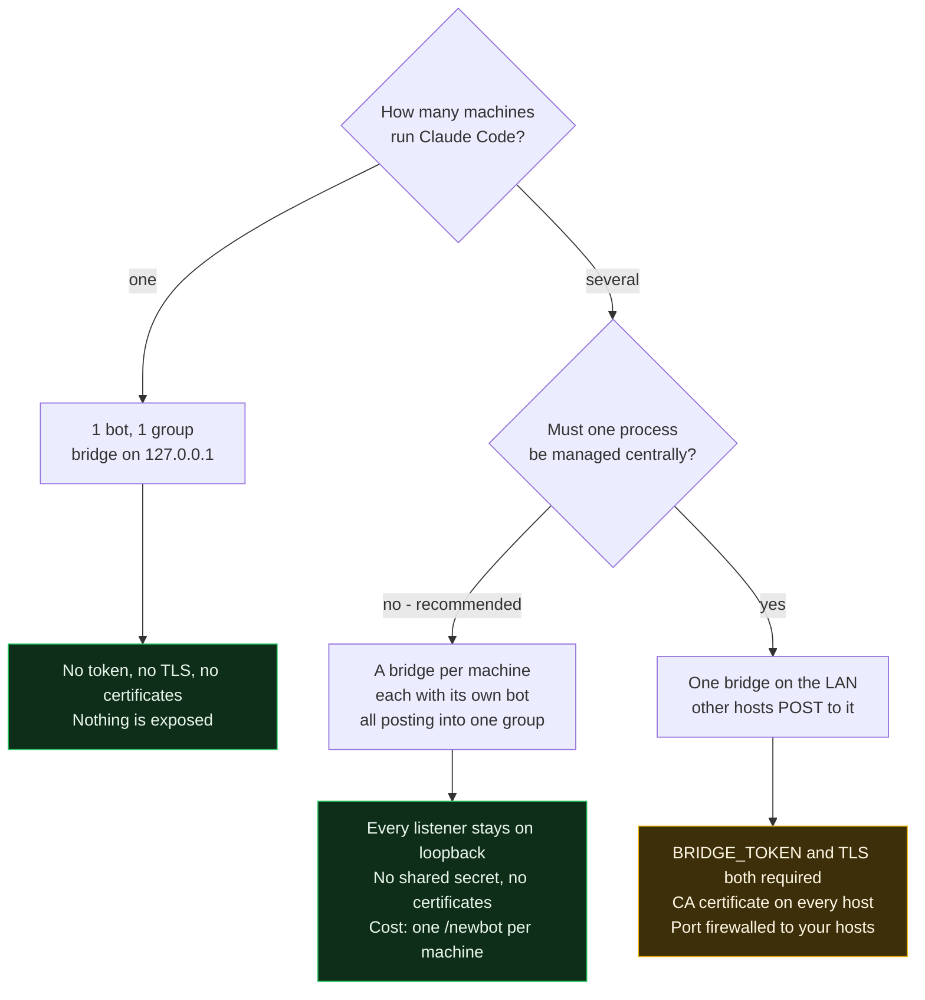

# bridge-for-agents

[](https://github.com/spazyCZ/bridge-for-agents/actions/workflows/ci.yml)
[](https://www.python.org/downloads/)
[](LICENSE)

Answer Claude Code's open questions and permission prompts from Telegram.
No Remote Control needed — built purely on Claude Code's HTTP hooks.

```
Claude Code ──HTTP hook──▶ bridge ──Bot API──▶ Telegram
Claude Code ◀──JSON decision── bridge ◀──button/reply── you
```

## Setup (5 minutes)

1. **Bot**: talk to `@BotFather` → `/newbot` → copy the token.
2. **Chat id**: send any message to your new bot, then
   `curl https://api.telegram.org/bot<TOKEN>/getUpdates` → `message.chat.id`.
3. **Run the bridge** (Python 3.11+):
   ```bash
   pip install .                       # or: pip install -e ".[dev]" to hack on it
   export TG_BOT_TOKEN=123:abc  TG_CHAT_ID=-1001234567890
   bridge-for-agents                   # or: python -m bridge_for_agents
   ```
   You should get "🟢 claude-bridge online" on Telegram.
4. **Hook it up**: merge `examples/hooks.settings.json` into `~/.claude/settings.json`
   (or a project's `.claude/settings.json`; with `CLAUDE_CONFIG_DIR` isolation
   put it in that config dir's `settings.json`). Check with `/hooks` in Claude Code.

## What you get on the phone

| Event | Message | Buttons |
|---|---|---|
| Permission prompt (any tool) | tool + command/file | Allow / Deny / Answer in terminal |
| `AskUserQuestion` | header, question, numbered options | one per option + terminal |
| Idle prompt (60 s waiting) | "waiting for input" | – |
| Turn finished | last assistant message | – |
| Session ended | closes the topic | – |

Everything above is also visible in the [web admin page](#web-admin-page).

### Typing instead of tapping

Reply to the bot's message. What you type is parsed, not passed through blindly:

| On a permission | Result |
|---|---|
| `y` `yes` `ok` `allow` `👍` | **allow** |
| `n` `no` `deny` `stop` `👎` | **deny**, no reason |
| `no, wrong branch` | **deny**, reason `wrong branch` |
| anything else | **deny**, your whole message as the reason |

| On a question | Result |
|---|---|
| `2` | option 2 |
| `2 - but check the migration first` | option 2, with the comment attached |
| `Postgres` | the option with that label |
| `3 replicas` | the answer `3 replicas` — a number needs a separator to count as a choice |
| `neither, use DuckDB` | that text as the answer |

**Affirmatives must be bare.** `yes` allows; `yes but only the first one`
denies, carrying the caveat to Claude as the reason. The asymmetry is
deliberate — reading a hedge as approval runs the command, while reading it as
a denial only sends the prompt back to your terminal. One of those is
recoverable.
- **Fallback**: no answer within `BRIDGE_TIMEOUT` (540 s) or "Answer in terminal"
  → bridge returns `{}` → Claude Code shows its normal prompt in the terminal.
  Hook timeout in settings is 600 s so the bridge always answers first.
- **Multiple sessions**: each gets its own topic — see below.

## Session separation

Each session gets its own **forum topic** in a Telegram supergroup: separate
scrollback, separate unread badge, and replies land in the right thread.

Setup:

1. Create a group → convert to supergroup → **enable Topics** in group settings.
2. Add the bot as an admin with *Manage Topics*.
3. Chat id is negative for supergroups, e.g. `TG_CHAT_ID=-1001234567890`
   (from `getUpdates` after posting in the group).

Scope is chosen with `BRIDGE_SCOPE`:

| Value | One topic per | Topic name | Good for |
|---|---|---|---|
| `session` (default) | Claude Code session | `myrepo · a1b2c3d4` | many parallel sessions, clean separation |
| `project` | working directory | `myrepo` | few long-lived repos, less topic churn |
| `flat` | – | – | one chat, sessions tagged inline |

- The map from scope key → `message_thread_id` is persisted in `BRIDGE_STATE`
  (default `~/.local/state/claude-bridge/topics.json`), so a bridge restart
  reuses existing topics instead of creating duplicates.
- On `SessionEnd` the bridge posts "session ended" and **closes** the topic —
  it stays readable in the archive but drops out of the active list.
- If the chat isn't a forum, the bridge logs a warning and runs flat, with the
  `📁 cwd · session-id` tag on every message. Nothing breaks.

Note that separation is only cosmetic on top of correlation that already works:
every request carries a random id embedded in its buttons, so an answer resolves
exactly the request it belongs to even in flat mode. Topics are about *your*
ability to tell sessions apart.

One bridge serves any number of parallel sessions — see
[Deployment](#deployment) for how bots, groups and bridges map onto machines.

## Deployment

Three ratios settle almost every question:

| | | |
|---|---|---|
| bridge : bot | **1 : 1** | hard constraint — `getUpdates` is exclusive per token |
| bridge : group | **N : 1** | several bots post into one group quite happily |
| bridge : sessions | **1 : many** | that is what topics are for |

So: **one bot per bridge process, one group for everything.** You never need a
bot per session, and a second group only buys separation that topics already
give you.



### One machine — the default

```
1 bot  ->  1 group  ->  1 bridge on 127.0.0.1  ->  many sessions, a topic each
```

Nothing else to configure. No token, no TLS, no certificates: the preflight
only demands those off loopback.

### Several machines — one bridge each

```
laptop   -> bridge on 127.0.0.1 -> bot A -.
desktop  -> bridge on 127.0.0.1 -> bot B -+-> one group, topics from all three
server   -> bridge on 127.0.0.1 -> bot C -'
```

Every listener stays on loopback, so there is no shared secret to rotate, no
certificate to issue or renew, no port reachable from your network, and no
`NODE_EXTRA_CA_CERTS` to distribute. The security story is "nothing is
exposed" rather than "everything is exposed but authenticated". The cost is one
`/newbot` per machine.

This is the recommended shape for more than one host.

### Several machines — one shared bridge

One bot, one group, one bridge on the LAN, with the other hosts posting to it.
`BRIDGE_TOKEN` **and** TLS both become mandatory — see
[Securing the channel](#securing-the-claude-code--bridge-channel); the preflight
refuses to start without them.

Worth it when one process really has to be managed centrally, or hosts come and
go. At three machines it is more moving parts than it saves, and it turns the
bridge port into a network-reachable endpoint that can approve tool calls.

| | Bots | Bridges | Token + TLS |
|---|---|---|---|
| One machine | 1 | 1, loopback | no |
| Many machines, one bridge each | 1 each | 1 each, loopback | no |
| Many machines, one shared bridge | 1 | 1, on the LAN | **both required** |

### The one configuration that breaks

Copying **one token to two machines.** `getUpdates` is exclusive, so both
pollers grab updates at random and a button press lands on whichever bridge
happened to poll first — silently wrong rather than loudly broken. One token,
one process, always.

## Notifications from the agent

A long-running task can push a line to your phone through an MCP tool, so you
are not tied to the terminal waiting for it.

```bash
claude mcp add bridge-notify -- bridge-for-agents-mcp
```

The server reads `BRIDGE_URL` (default `http://127.0.0.1:8765`) and
`BRIDGE_TOKEN`. It exposes exactly one tool:

| | |
|---|---|
| `notify_user` | `message`, and `level` of `info` / `warn` / `error` |

The typical use is `/loop`: report when something changes, once at the end, and
stay quiet otherwise.

**It is send-only, and that is deliberate.** It posts to `/notify`, which sends
and returns — nothing is awaited and no chat content comes back. There is no
tool that reads a reply, and there will not be: that would turn a one-way
approval channel into a bidirectional one. To ask a question, use
`AskUserQuestion`, which the bridge already routes to the same phone with
buttons.

Notifications are [redacted](#logs) like any other outgoing message, recorded
in the [audit log](#audit-log) with the message in full, and capped at
`BRIDGE_NOTIFY_RATE` (20 a minute) so a runaway loop cannot flood you.
`BRIDGE_NOTIFY=0` refuses them.

### The skill

`skills/notify-user/` is a Claude Code skill telling the agent what belongs in
a notification and, more importantly, what must never go in one — credentials,
file contents, stack traces, customer data. Install it with:

```bash
cp -r skills/notify-user ~/.claude/skills/
```

Redaction is a backstop, not a licence. It knows common key shapes; it does not
know your customer's phone number or your internal hostnames. The skill exists
so the agent gets it right before the redactor has to.

## Logs

Two logs, opposite rules — confusing them would be a bug.

| | Diagnostic log | [Audit log](#audit-log) |
|---|---|---|
| For | working out what the daemon is doing | evidence of what was asked and approved |
| Secrets | **redacted** | **kept in full** — that is the point |
| Where | stderr, and `BRIDGE_LOG_FILE` if set | `BRIDGE_AUDIT` |
| Safe to ship elsewhere | yes | only where you would keep the commands themselves |

```bash
export BRIDGE_LOG_LEVEL=DEBUG            # DEBUG | INFO | WARNING | ERROR
export BRIDGE_LOG_FILE=~/bridge.log      # mode 0600, rotates at 10 MB, 5 kept
export BRIDGE_LOG_ACCESS=1               # aiohttp per-request log, off by default
```

Everything written to the diagnostic log passes through the same redactor the
chat messages use, applied as a logging *filter* so it covers every handler and
cannot be bypassed by adding another one. `BRIDGE_LOG_FILE` is `0600`, and stays
`0600` across rotations.

`BRIDGE_LOG_ACCESS` is off by default on purpose: the admin page polls every two
seconds, so aiohttp's access log would write roughly 1,800 lines an hour saying
so and bury everything else.

At `DEBUG` you additionally get every Telegram API call (without message bodies
or keyboards), each inbound update id, and each prompt as it opens.

## Audit log

Every request and every decision, appended to `BRIDGE_AUDIT` (default
`~/.local/state/claude-bridge/audit.jsonl`, mode `0600`, `fsync` on each
write). `BRIDGE_AUDIT=off` disables it.

```json
{"seq":2,"ts":"2026-09-06T14:22:31.104Z","type":"request_open","session_id":"a1b2…",
 "cwd":"/repo","event":"PermissionRequest","tool":"Bash","input":{"command":"…"}}
{"seq":3,"ts":"2026-09-06T14:22:39.208Z","type":"decision","ref":2,
 "outcome":"allow","source":"button","latency_ms":8104}
```

Six record types: `bridge_start` (with a config fingerprint, never the
secrets), `request_open`, `decision`, `rejected_unsolicited`, `auth_failure`,
`bridge_stop`.

Two things make it evidence rather than a second log:

- **It keeps the full tool input**, not the redacted summary the chat sees. The
  phone message is a UI; this is the record.
- **`source` separates what you approved from what the bridge declined to
  decide** — `button`, `text`, `timeout`, `terminal`. A `{}` returned because
  nobody answered and a `{}` returned because you chose the terminal are very
  different events, and only this field tells them apart.

### Tamper-evidence

Set `BRIDGE_AUDIT_KEY` and each record carries `prev` and `mac`, chaining it to
the one before:

```
mac = HMAC-SHA256(key, prev || canonical_json(record without prev and mac))
```

```bash
bridge-audit-verify                       # the default path
bridge-audit-verify audit.jsonl --key …   # exits non-zero on any break
bridge-audit-verify --session a1b2        # read one session's history
```

A modified or deleted line is named by sequence number. **Keep the key away
from the log** — different file, different mode, ideally a different owner.

This detects tampering by anyone who does not hold the key. It does **not**
stop someone holding both the key and the file from rewriting the chain from
scratch; no local-only scheme can. The honest fix is an external anchor —
periodically posting the chain head somewhere you do not control — which is
planned but [not built yet](PLAN.md).

## Web admin page

A read-only dashboard at `/admin` on the same listener as the hook endpoint:
what Claude Code is waiting for **right now**, and what it has asked for
recently.

```bash
export BRIDGE_ADMIN=1
export BRIDGE_ADMIN_TOKEN=$(openssl rand -hex 32)   # required off loopback
bridge-for-agents
# open http://127.0.0.1:8765/admin?token=<BRIDGE_ADMIN_TOKEN>
```

- **Waiting now** — every outstanding prompt with its options and a countdown
  to `BRIDGE_TIMEOUT`, so you can see what is blocking a session before you
  reach for your phone.
- **Sessions** — one row per session or project: working directory, short
  session id, event counts, live/ended, last activity. Click one to filter.
- **Activity** — the event timeline: time, hook event, tool, the command or
  file path, the outcome (`allow`, `deny`, `deny (reason)`, `answered`,
  `terminal`, `timeout`) and how long the answer took.

The page polls `/admin/api/state` every two seconds; the same JSON is there if
you would rather script against it.

**It is read-only by design.** There is no way to approve or deny from the
browser — decisions stay in the chat, where the approval path is already
authenticated. The page only reports.

### History is in memory only

Sessions and events live in the daemon's process and are never written to
disk, so **restarting the bridge starts the history over**. That is deliberate:
the events carry your commands, file paths and prompts, and keeping them out of
a file keeps the bridge host's blast radius small. `BRIDGE_ADMIN_HISTORY`
(default 200) caps the events kept per session; at most 50 sessions are kept,
the least recently active dropped first. `src/bridge_for_agents/store.py` is
the single place to add persistence if you ever want it.

Note this is separate from `BRIDGE_STATE`, which persists only the map from
session to Telegram topic id — never any event content.

### Access

`BRIDGE_ADMIN_TOKEN` guards the page, falling back to `BRIDGE_TOKEN` when
unset. Pass it once as `?token=…`; it is then kept in an `HttpOnly`,
`SameSite=Strict` cookie (marked `Secure` under TLS) so the secret leaves the
URL bar. A `Bearer` header works too, for scripts.

Like the hook endpoint, a loopback bind with no token configured is left open,
and the startup preflight refuses to serve the page on a non-loopback bind
without a token — it shows tool inputs and session history to anyone who can
reach it.

## Securing the Claude Code ↔ bridge channel

The hook endpoint is the sensitive surface: whatever can POST to it can approve
your tool calls. Two controls, both set up by `scripts/make-certs.sh`:

```bash
./scripts/make-certs.sh bridge.lan 10.0.0.5   # hostname in the hook URL + any extra IPs
```

It prints ready-to-paste exports and writes `pki/`:

| File | Goes to | Mode |
|---|---|---|
| `server.crt`, `server.key` | bridge host | key `0600` |
| `ca.crt` | every Claude Code host | `0644` |
| `ca.key` | keep offline, only needed to issue more certs | `0600` |

**1. Shared key.** `BRIDGE_TOKEN` is a 32-byte random hex string, checked with
`hmac.compare_digest` on every request. Claude Code sends it as
`Authorization: Bearer ${BRIDGE_TOKEN}`, interpolated from the environment
because `allowedEnvVars` lists it — so the secret never enters `settings.json`
and never reaches git. Keep it in your shell profile, a `systemd`
`EnvironmentFile` with mode `0600`, or your usual secret store.

**2. TLS.** With `BRIDGE_TLS_CERT` / `BRIDGE_TLS_KEY` set, the listener speaks
HTTPS (TLS 1.2 minimum) and the hook URL becomes `https://`. Without it the
bearer token crosses the LAN in cleartext, which defeats the point of having one.
Each Claude Code host trusts the CA via `NODE_EXTRA_CA_CERTS=/path/to/ca.crt`.
The hostname in the hook URL must match a SAN in the cert.

**Startup preflight.** The bridge exits rather than expose a weak listener: a
non-loopback bind with no token, a non-loopback bind with no TLS, or a token
under 32 chars all abort with an explanation. `BRIDGE_INSECURE=1` overrides for
lab use. A loopback-only bind needs neither.

Also worth doing:

- Firewall the port to your Claude Code hosts only.
- Rotate `BRIDGE_TOKEN` by restarting the bridge and updating each host; there's
  no rotation grace period, so do it when nothing is mid-approval.
- Deny is the safe answer when a prompt on your phone surprises you — it means
  something reached the bridge that you didn't start.

Not available: mutual TLS. Claude Code's HTTP hooks send no client certificate,
so the bearer token is the client's identity. If you need stronger, put an mTLS
reverse proxy in front and keep the bridge on loopback behind it.

## Network / private LAN

Works behind NAT with no port forwarding and no tunnel:

- **Outbound only, to Telegram.** Both directions are HTTPS to
  `api.telegram.org:443`. Pushing = `sendMessage`; receiving = `getUpdates` long
  polling (`timeout=30`, held open by Telegram, so replies arrive in ~a second).
- **No webhook.** The daemon calls `deleteWebhook` at startup — a bot can't use
  a webhook and `getUpdates` simultaneously.
- **Proxy**: the client uses `trust_env=True`, so `HTTPS_PROXY` / `NO_PROXY` are honoured.
- Dropped connections are retried by the poll loop (3 s backoff); a host resuming
  from sleep just reconnects.

### Bridge and Claude Code on different hosts

The mechanics of the shared-bridge topology in [Deployment](#deployment). If
you would rather not set up a token and certificates, running a bridge per
machine avoids all of this — every listener stays on loopback.

Set `BRIDGE_BIND` to the LAN address (or `0.0.0.0`) on the bridge host and point
`examples/hooks.settings.json` at `https://bridge.lan:8765/hook` — change the hostname to
match the SAN in your cert. Token and TLS setup is in
[Securing the channel](#securing-the-claude-code--bridge-channel) above; the
bridge won't start on a network interface without both. Never expose this port
to the internet.

Only the later Twilio/WhatsApp channel needs a public inbound webhook — that one
does require a tunnel (`cloudflared` / ngrok).

## Security

Full detail — who starts each connection, what the chat can and cannot make
your machine do, who is trusted, and a pre-flight checklist — is in
**[SECURITY-MODEL.md](SECURITY-MODEL.md)**. The three facts that matter most:

- **Nothing on the internet can connect to your machine.** Both directions to
  Telegram are outbound; receiving an answer is the bridge holding a
  `getUpdates` request open, not Telegram dialling in. The only listener is the
  hook endpoint, on `127.0.0.1` unless you change it.
- **Credentials are stripped before they leave the host.** AWS, GitHub,
  OpenAI, Slack and Google keys, JWTs, private keys, `PASSWORD=…` assignments,
  `--token` flags and `Bearer` headers are replaced, and the message says how
  many were hidden. Best effort, not a guarantee — `BRIDGE_REDACT=0` disables
  it, `BRIDGE_REDACT_EXTRA` adds your own patterns.
- **The chat cannot start anything.** It can only answer a hook Claude Code
  already raised, and an approval covers that one tool call. But a free-text
  reply becomes a deny reason or a question's answer, so it *does* reach
  Claude's context — the chat can steer a session even though it cannot command
  one.
- **The bridge fails safe.** Timeouts, exceptions and Telegram outages all
  return `{}`, which means "prompt in the terminal". No error path can produce
  an approval.

Everyone in the chat holds your approval authority — the bridge checks the chat
a press came from, not the person. Keep it to yourself and the bot; see
[the roadmap](ROADMAP.md#approver-identity-tg_allowed_users).

## Project layout

```
src/bridge_for_agents/
  bridge.py            the daemon: channels, hook handlers, HTTP endpoint
  store.py             in-memory session/event history behind the admin page
  admin.py             read-only /admin routes and page
  cli.py               console entry point (bridge-for-agents)
examples/
  hooks.settings.json  Claude Code hook config to merge into your settings
scripts/
  make-certs.sh        local CA, server cert, shared secret
tests/                 pytest suite
```

## Development

```bash
python -m venv .venv && source .venv/bin/activate
pip install -e ".[dev]"

ruff check .
pytest
```

See [CONTRIBUTING.md](CONTRIBUTING.md) for the full workflow.

### Trying it without a bot

`TG_API_BASE` overrides the Bot API root (default `https://api.telegram.org`),
so the bridge can be pointed at a stand-in server. The sibling
[bridge-for-agent-test](../bridge-for-agent-test) project is exactly that: a
fake Telegram with a browser "phone" whose buttons feed real `callback_query`
updates back through `getUpdates`, sample payloads for every hook event, a
ready-made `.claude/settings.json`, and an end-to-end check.

```bash
cd ../bridge-for-agent-test
./bin/up.sh        # fake phone + bridge
./bin/smoke.py     # automated end-to-end check
```

## Known gaps / next steps

Fuller reasoning, with priorities, is in [ROADMAP.md](ROADMAP.md).

- `multiSelect` questions are answered single-choice (MVP).
- **Sending a *new* prompt into a running interactive session is not possible
  via hooks.** Options for v2: (a) `tmux send-keys` into the session pane,
  (b) let the bridge run follow-ups headless: `claude -p --resume <session_id> "<text>"`
  and stream the result back — the `session_id` is already in every hook payload.
- Run as a service: `systemd --user` unit or a Docker container on the same host
  as Claude Code (hooks post to localhost).

## Adding WhatsApp (Twilio) later

Implement `Channel` (`send`, `ask`) in a `TwilioChannel`:
- `ask` sends the text with numbered options; the reply "1"/"2"/free text resolves the future.
- Twilio needs a public webhook for inbound messages → expose the bridge via
  `cloudflared tunnel` / ngrok and add `POST /twilio` that validates the Twilio signature.
- Both channels can run at once; route by session or by a `BRIDGE_CHANNEL` env var.

## Contributing

Issues and pull requests are welcome — see [CONTRIBUTING.md](CONTRIBUTING.md)
and the [Code of Conduct](CODE_OF_CONDUCT.md). For anything security-related,
follow [SECURITY.md](SECURITY.md) instead of opening a public issue.

## License

[MIT](LICENSE) © 2026 Roman Marek
