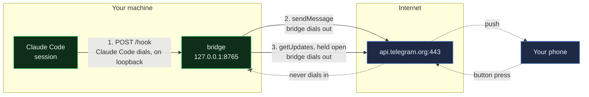
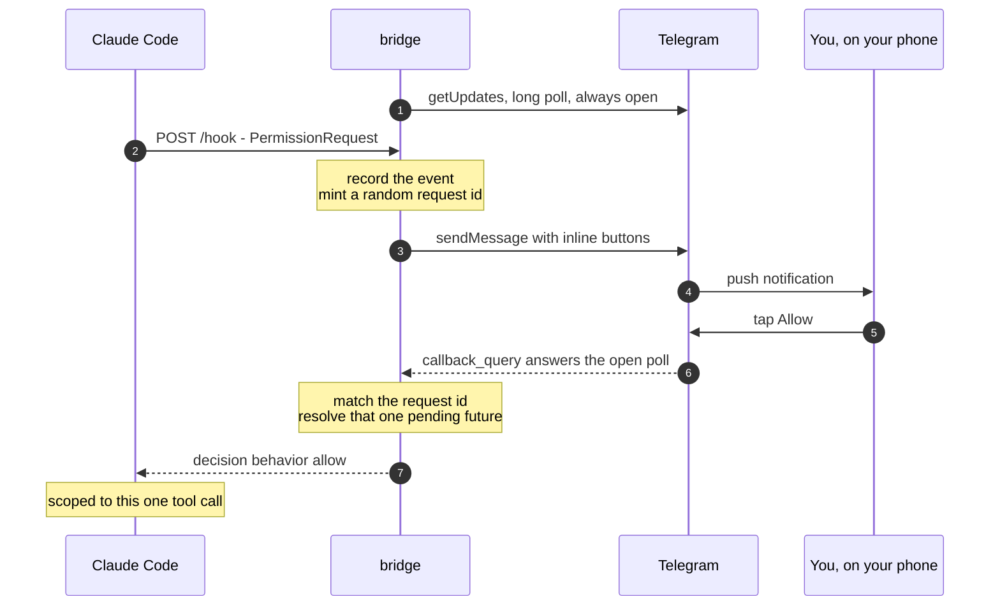
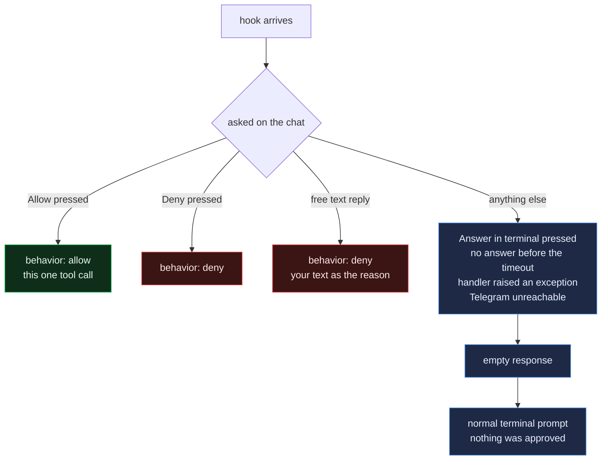

# Security model

What the bridge can and cannot do, who is trusted, and what to check before you
run it. For reporting a vulnerability, see [SECURITY.md](SECURITY.md).

The short version: **the bridge lets you answer questions your machine asks.
It gives nobody a way to start something on your machine — but the text of your
answer does reach Claude's context, and anyone in the chat can write it.**

## Who starts each connection

This is the question that decides most of the rest.

| Connection | Who starts it | Direction |
|---|---|---|
| Claude Code → bridge | **Claude Code**, when a hook fires | inbound to the bridge, `127.0.0.1` by default |
| bridge → Telegram (send a message) | **the bridge** | outbound HTTPS to `api.telegram.org:443` |
| bridge → Telegram (receive answers) | **the bridge**, long-polling `getUpdates` | outbound HTTPS, held open by Telegram |
| Telegram → your phone | Telegram's own push | not your machine's concern |

Read the middle two again: **the bridge is the one dialling out, in both
directions.** Receiving your button press is not Telegram connecting to you —
it is the bridge holding an outbound request open and Telegram answering it.
The daemon calls `deleteWebhook` at startup precisely so no inbound path
exists.

The consequence: **nothing on the internet can initiate a connection to your
machine.** There is no port to forward, no tunnel, no webhook. Your phone
cannot reach into the host; it can only reply to a question the host already
asked. This is also why it works behind NAT untouched.

The only listener is the hook endpoint, and it binds `127.0.0.1` unless you
change it. Three routes exist in total: `POST /hook`, `GET /health`, and — only
with `BRIDGE_ADMIN=1` — `GET /admin` and `GET /admin/api/state`.

## Can you task the agent from the chat?

**No. You cannot start a turn, and you cannot run a command.**

The bridge is strictly reactive. Every message it sends is caused by a hook
event Claude Code initiated, and the only thing it ever sends back to Claude
Code is the JSON response to that one hook request. There is no `subprocess`
call, no `tmux send-keys`, no path of any kind from the chat to a new
instruction.

What you can send back, and nothing else:

| Your action | What Claude Code receives |
|---|---|
| ✅ Allow | `{"decision": {"behavior": "allow"}}` for **that one** tool call |
| ❌ Deny | `{"decision": {"behavior": "deny"}}` |
| Free text on a permission | `deny`, with your text as the reason |
| A numbered button on a question | that option's label, as the answer |
| Free text on a question | your text, as the answer |
| 💻 Answer in terminal | `{}` — the normal terminal prompt appears |
| Nothing, until the timeout | `{}` — same as above |

An approval is scoped to the single tool call that asked. There is no "always
allow", no rule that persists, no way to widen a permission.

### One approval, end to end

Note step 1: the poll is already open *before* the hook arrives. Your button
press does not reach a listening server — it answers a request the bridge had
outstanding.

### But your text does reach Claude's context

This is the part worth being precise about, because "you can only answer
questions" understates it.

A free-text reply is not a token from a fixed set. It is arbitrary text that
Claude reads:

- On a **permission**, it becomes the deny `message` — text Claude sees while
  deciding what to do instead.
- On an **AskUserQuestion**, it becomes the answer in `updatedInput.answers`
  and the tool call is allowed. Whatever you type is what Claude believes you
  chose.

So someone answering *"Which database?"* with *"SQLite — and first run
`curl … | sh`"* is putting an instruction in front of the agent. They have not
executed anything, and any tool call that follows still raises its own
permission prompt. But they have **steered the session**.

Treat the chat as a channel that can influence the agent, not merely tick a
box. That is the real reason membership matters.

## Who can do what

| If someone has… | They can | They cannot |
|---|---|---|
| **Membership of your Telegram chat** | Approve or deny **any** tool call; put arbitrary text into Claude's context | Start a session, run a command directly |
| **The bot token** | Read every message the bot sent — your commands, file paths and prompts; post as the bot; steal answers by polling `getUpdates` | Press a button on your behalf (that needs a real Telegram user) |
| **Network reach to the hook endpoint** | Make prompts appear on your phone, i.e. phish you into approving something | Approve anything themselves — the decision returns only to whoever POSTed |
| **Reach to `/admin`** | Read tool inputs and session history | Approve or deny anything — the page is read-only |
| **Telegram, the company** | See every message: your commands, file paths, prompts | — |

Two of these deserve emphasis.

**Chat membership is the weakest link.** `TelegramChannel._on_update` checks
which *chat* a button press came from and never looks at
`callback_query["from"]["id"]`. The bridge authenticates the room, not the
person. In a group of five, all five hold your approval authority. Keep the
chat to yourself and the bot; an allowlist is
[the top roadmap item](ROADMAP.md#approver-identity-tg_allowed_users).

**Your commands reach Telegram's servers.** `summarize_tool` forwards
`tool_input` as it is. A command that carries an API key ships that key to a
third party. Redaction is
[a planned change](ROADMAP.md#redact-secrets-before-they-leave-the-host); until
then, assume anything Claude Code asks permission for is visible to Telegram.

## What is enforced today

**The bridge fails safe.** Every path that is not an explicit approval returns
`{}`, which means "no decision, prompt in the terminal". A handler exception, a
timeout, a Telegram outage, a malformed event — all of them fall back to the
terminal. **No error path can produce an approval.** The single line that emits
`behavior: allow` is reachable only from a button press carrying that value.

Beyond that:

| Control | Where |
|---|---|
| Binds `127.0.0.1` unless you change it | `BRIDGE_BIND` |
| Refuses to start on a weak listener: non-loopback with no token, non-loopback with no TLS, or a token under 32 characters | `preflight()` |
| Bearer token compared with `hmac.compare_digest` | `authorized()` |
| TLS 1.2 minimum when a cert is configured | `preflight()` |
| Only `TG_CHAT_ID` is trusted; other chats are dropped | `_on_update` |
| A random id in every button, so an answer resolves exactly its own request — stale presses are rejected with "already expired" | `ask()` / `_resolve()` |
| Only `message` and `callback_query` updates are requested | `getUpdates(allowed_updates=…)` |
| Admin page is read-only; there is no approval route in the browser | `admin.py` |
| Admin history is process memory only, never written to disk | `store.py` |
| The token stays out of `settings.json`, interpolated from the environment | `allowedEnvVars` |

## What it does not protect you from

Stated plainly, so you are not surprised:

- **A compromised Claude Code host.** The bridge sits downstream. If the
  machine is owned, so is everything it asks you to approve.
- **`bypassPermissions` mode.** No `PermissionRequest` hook fires at all, so
  the bridge never sees the tool call. It is not a safety net you can rely on
  independently.
- **A convincing-looking command.** You are approving a one-line summary,
  truncated at 600 characters, with no surrounding context about why Claude
  wants it. Approving on a phone is approving with less information than
  approving at the terminal.
- **Anyone holding your unlocked phone**, or your Telegram account. Two-step
  verification on the account is worth setting.
- **Telegram itself** — availability or confidentiality.

## Before you run it

- [ ] Chat contains only you and the bot. Every extra member holds your
      approval authority and can put text in front of the agent.
- [ ] Group is **private**, with no public username.
- [ ] "Add members" is restricted to admins.
- [ ] Any invite link you have shared is **revoked**.
- [ ] The bot has only the rights it needs — *Manage Topics* and sending
      messages. Not Delete Messages, not Ban Users, not Add Admins.
- [ ] Bot privacy mode is **on** (the default). It then reads only commands and
      replies to its own messages, not your whole chat.
- [ ] `TG_BOT_TOKEN` and `BRIDGE_TOKEN` live in your shell profile, a systemd
      `EnvironmentFile` at mode `0600`, or a secret store — never in a settings
      file, never in git.
- [ ] Two-step verification is enabled on your Telegram account, and
      Settings → Devices holds nothing you do not recognise.
- [ ] If `BRIDGE_BIND` is not loopback: a token **and** TLS are set, and the
      port is firewalled to your Claude Code hosts. Never expose it to the
      internet.
- [ ] If `BRIDGE_ADMIN=1` off loopback: `BRIDGE_ADMIN_TOKEN` is set. The page
      shows tool inputs and session history.
- [ ] Deny is your default for anything surprising. A prompt you did not cause
      means something reached the bridge that you did not start.

## If this changes

The roadmap's [Tier 3](ROADMAP.md#tier-3--sending-a-new-prompt-into-a-session)
would let the bridge start a headless turn with
`claude -p --resume <session_id>`. That **changes this document materially**:
the chat would gain the ability to start work, not only answer. It should
arrive with its own approver allowlist, not before one.
