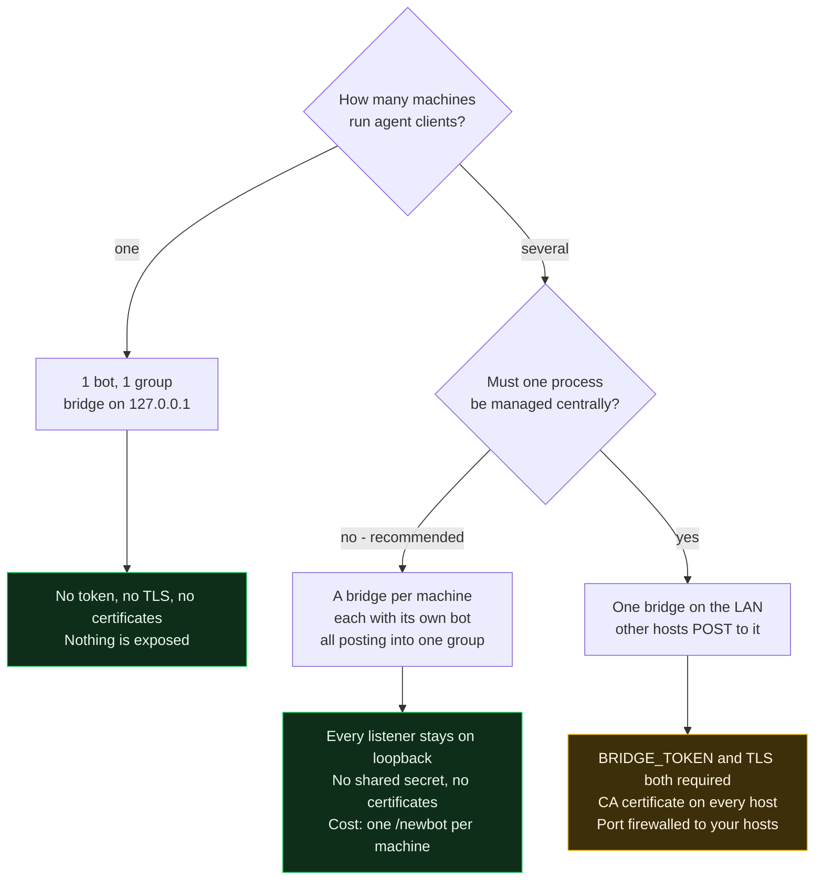

# User guide

Everything needed to run the bridge day to day. The [README](README.md) gets
you to a first prompt on your phone; this is the rest.

- [Setting up Telegram](#setting-up-telegram)
- [Sessions and topics](#sessions-and-topics)
- [Answering prompts](#answering-prompts)
- [Deployment](#deployment)
- [Notifications from the agent](#notifications-from-the-agent)
- [The admin page](#the-admin-page)
- [Logs](#logs)
- [Audit log](#audit-log)
- [Securing the channel](#securing-the-channel)
- [Networking](#networking)
- [Troubleshooting](#troubleshooting)

## Setting up Telegram

The bot itself takes a minute; the parts people get stuck on are the group.

1. **Create the bot.** `@BotFather` → `/newbot` → copy the token. Keep it in
   your shell profile or a `0600` file, never in a settings file or git.
2. **Create the group**, in the mobile or desktop app (not Telegram Web, which
   has no Topics toggle): New Group → add any contact → name it. Telegram will
   not create an empty group, so add someone you can remove afterwards.
3. **Turn on Topics.** Tap the group name → Edit → toggle **Topics** → Save.
   This converts it to a supergroup. There is no longer a member minimum.
4. **Add the bot**: open `https://t.me/<yourbot>` → ⋮ → *Add to Group or
   Channel*. A bot cannot join through an invite link.
5. **Make it an admin with Manage Topics.** Group name → Administrators → Add
   Admin → the bot → enable **Manage Topics**. Without this the bridge cannot
   call `createForumTopic` and quietly posts everything in General.
6. **Let the bot see the chat.** Post `/start@<yourbot>` in General.

Step 6 is the one that confuses people. Bots run with **privacy mode on** by
default, so a plain message in a group never reaches them — only commands,
@mentions, and replies to their own messages. A bare `/start` is not routed to
your bot either; the `@<yourbot>` suffix is what matters. Until something
reaches the bot, `getUpdates` reports no chats and you cannot find the chat id.

Leave privacy mode on. The bridge only needs replies to its own messages, and
turning it off would let the bot read everything in the group for no gain.

Your chat id is negative and starts `-100` for a supergroup. The
[test project](../bridge-for-agent-test) has `bin/tg-setup.sh`, which does all
of the discovery and writes a `.env` for you.

## Sessions and topics

Each session gets its own **forum topic** in a Telegram supergroup: separate
scrollback, separate unread badge, and replies land in the right thread.

Setup:

1. Create a group → convert to supergroup → **enable Topics** in group settings.
2. Add the bot as an admin with *Manage Topics*.
3. Chat id is negative for supergroups, e.g. `TG_CHAT_ID=-1001234567890`
   (from `getUpdates` after posting in the group).

Scope is chosen with `BRIDGE_SCOPE`:

| Value | One topic per | Topic name | Good for |
|---|---|---|---|
| `session` (default) | agent session | `myrepo · a1b2c3d4` | many parallel sessions, clean separation |
| `project` | working directory | `myrepo` | few long-lived repos, less topic churn |
| `flat` | – | – | one chat, sessions tagged inline |

- The map from scope key → `message_thread_id` is persisted in `BRIDGE_STATE`
  (default `~/.local/state/claude-bridge/topics.json`), so a bridge restart
  reuses existing topics instead of creating duplicates.
- On `SessionEnd` the bridge posts "session ended" and **closes** the topic —
  it stays readable in the archive but drops out of the active list.
- If the chat isn't a forum, the bridge logs a warning and runs flat, with the
  `📁 cwd · session-id` tag on every message. Nothing breaks.

Note that separation is only cosmetic on top of correlation that already works:
every request carries a random id embedded in its buttons, so an answer resolves
exactly the request it belongs to even in flat mode. Topics are about *your*
ability to tell sessions apart.

One bridge serves any number of parallel sessions — see
[Deployment](#deployment) for how bots, groups and bridges map onto machines.

## Answering prompts

| Event | Message | Buttons |
|---|---|---|
| Permission prompt (any tool) | tool + command/file | Allow / Deny / Answer in terminal |
| Claude Code `AskUserQuestion` | header, question, numbered options | one per option + terminal |
| Idle prompt (60 s waiting) | "waiting for input" | – |
| Turn finished | last assistant message | – |
| Session ended | closes the topic | – |

Everything above is also visible in the [web admin page](#the-admin-page).

#### Typing instead of tapping

Reply to the bot's message. What you type is parsed, not passed through blindly:

| On a permission | Result |
|---|---|
| `y` `yes` `ok` `allow` `👍` | **allow** |
| `n` `no` `deny` `stop` `👎` | **deny**, no reason |
| `no, wrong branch` | **deny**, reason `wrong branch` |
| anything else | **deny**, your whole message as the reason |

| On a question | Result |
|---|---|
| `2` | option 2 |
| `2 - but check the migration first` | option 2, with the comment attached |
| `Postgres` | the option with that label |
| `3 replicas` | the answer `3 replicas` — a number needs a separator to count as a choice |
| `neither, use DuckDB` | that text as the answer |

**Affirmatives must be bare.** `yes` allows; `yes but only the first one`
denies, carrying the caveat to the agent as the reason. The asymmetry is
deliberate — reading a hedge as approval runs the command, while reading it as
a denial only sends the prompt back to your terminal. One of those is
recoverable.
- **Fallback**: no answer within `BRIDGE_TIMEOUT` (540 s) or "Answer in terminal"
  → bridge returns `{}`, meaning *no decision* → the client uses its local
  approval flow, or denies the call in a session that cannot prompt. Neither
  approves. The hook timeout is 600 s so the bridge always answers first.
- **Multiple sessions**: each gets its own topic — see below.

## Deployment

Three ratios settle almost every question:

| | | |
|---|---|---|
| bridge : bot | **1 : 1** | hard constraint — `getUpdates` is exclusive per token |
| bridge : group | **N : 1** | several bots post into one group quite happily |
| bridge : sessions | **1 : many** | that is what topics are for |

So: **one bot per bridge process, one group for everything.** You never need a
bot per session, and a second group only buys separation that topics already
give you.



#### Knowing which bridge you are looking at

On startup each bridge posts a card to the group's **General** topic — not to a
session thread, so it is somewhere you can find it later:

```
🟢 bridge online
host     rma-ntb
version  0.1.0
bot      @rma_cc_private_01_bot
chat     -1004464194534 · forum
scope    session · answer within 300s
```

With one bridge per machine sharing a group, this is what tells you which
machine just came online, which bot it is using and which chat it thinks it is
serving — enough to catch a bridge running where you did not expect one.

**Identity only, deliberately.** No security posture, no listener address: a
chat is the wrong place to publish which controls are off, and anyone reading
it is either you or someone you would rather not hand a list of weaknesses.
The full configuration fingerprint — bind, port, TLS, hook auth, admin,
redaction, audit — goes to the [audit log's](#audit-log) `bridge_start` record
instead, which stays on the host.

A `🔴 bridge offline` note follows on a clean shutdown, so a silent bridge can
be told from a stopped one.

**If two bridges ever share a bot token**, `getUpdates` returns 409 and the
group gets a one-time warning naming the bot and one of the hosts. That
misconfiguration is otherwise invisible: both pollers take updates at random,
so an answer lands on whichever polled first — wrong rather than broken.

#### One machine — the default

```
1 bot  ->  1 group  ->  1 bridge on 127.0.0.1  ->  many sessions, a topic each
```

Nothing else to configure. No token, no TLS, no certificates: the preflight
only demands those off loopback.

#### Several machines — one bridge each

```
laptop   -> bridge on 127.0.0.1 -> bot A -.
desktop  -> bridge on 127.0.0.1 -> bot B -+-> one group, topics from all three
server   -> bridge on 127.0.0.1 -> bot C -'
```

Every listener stays on loopback, so there is no shared secret to rotate, no
certificate to issue or renew, no port reachable from your network, and no
`NODE_EXTRA_CA_CERTS` to distribute. The security story is "nothing is
exposed" rather than "everything is exposed but authenticated". The cost is one
`/newbot` per machine.

This is the recommended shape for more than one host.

#### Several machines — one shared bridge

One bot, one group, one bridge on the LAN, with the other hosts posting to it.
`BRIDGE_TOKEN` **and** TLS both become mandatory — see
[Securing the channel](#securing-the-channel); the preflight
refuses to start without them.

Worth it when one process really has to be managed centrally, or hosts come and
go. At three machines it is more moving parts than it saves, and it turns the
bridge port into a network-reachable endpoint that can approve tool calls.

| | Bots | Bridges | Token + TLS |
|---|---|---|---|
| One machine | 1 | 1, loopback | no |
| Many machines, one bridge each | 1 each | 1 each, loopback | no |
| Many machines, one shared bridge | 1 | 1, on the LAN | **both required** |

#### The one configuration that breaks

Copying **one token to two machines.** `getUpdates` is exclusive, so both
pollers grab updates at random and a button press lands on whichever bridge
happened to poll first — silently wrong rather than loudly broken. One token,
one process, always.

## Notifications from the agent

A long-running task can push a line to your phone through an MCP tool, so you
are not tied to the terminal waiting for it.

```bash
claude mcp add bridge-notify -- bridge-for-agents-mcp
codex mcp add bridge-notify -- bridge-for-agents-mcp
```

The server reads `BRIDGE_URL` (default `http://127.0.0.1:8765`) and
`BRIDGE_TOKEN`. It exposes exactly one tool:

| | |
|---|---|
| `notify_user` | `message`, and `level` of `info` / `warn` / `error` |

The typical use is `/loop`: report when something changes, once at the end, and
stay quiet otherwise.

**It is send-only, and that is deliberate.** It posts to `/notify`, which sends
and returns — nothing is awaited and no chat content comes back. There is no
tool that reads a reply, and there will not be: that would turn a one-way
approval channel into a bidirectional one. Claude Code's `AskUserQuestion` is
routed to the same phone with buttons. Codex's current hook contract cannot
return a question answer, so Codex questions remain in its UI.

Notifications are [redacted](#logs) like any other outgoing message, recorded
in the [audit log](#audit-log) with the message in full, and capped at
`BRIDGE_NOTIFY_RATE` (20 a minute) so a runaway loop cannot flood you.
`BRIDGE_NOTIFY=0` refuses them.

#### The skill

`skills/notify-user/` is an agent skill explaining what belongs in
a notification and, more importantly, what must never go in one — credentials,
file contents, stack traces, customer data. Install it with:

```bash
bridge-for-agents install-skills
bridge-for-agents install-skills --client codex
```

Redaction is a backstop, not a licence. It knows common key shapes; it does not
know your customer's phone number or your internal hostnames. The skill exists
so the agent gets it right before the redactor has to.

## The admin page

A read-only dashboard at `/admin` on the same listener as the hook endpoint:
what an agent is waiting for **right now**, and what it has asked for
recently.

```bash
export BRIDGE_ADMIN=1
export BRIDGE_ADMIN_TOKEN=$(openssl rand -hex 32)   # required off loopback
bridge-for-agents
# open http://127.0.0.1:8765/admin?token=<BRIDGE_ADMIN_TOKEN>
```

- **Waiting now** — every outstanding prompt with its options and a countdown
  to `BRIDGE_TIMEOUT`, so you can see what is blocking a session before you
  reach for your phone.
- **Sessions** — one row per session or project: working directory, short
  session id, event counts, live/ended, last activity. Click one to filter.
- **Activity** — the event timeline: time, hook event, tool, the command or
  file path, the outcome (`allow`, `deny`, `deny (reason)`, `answered`,
  `terminal`, `timeout`) and how long the answer took.

The page polls `/admin/api/state` every two seconds; the same JSON is there if
you would rather script against it.

**It is read-only by design.** There is no way to approve or deny from the
browser — decisions stay in the chat, where the approval path is already
authenticated. The page only reports.

#### History is in memory only

Sessions and events live in the daemon's process and are never written to
disk, so **restarting the bridge starts the history over**. That is deliberate:
the events carry your commands, file paths and prompts, and keeping them out of
a file keeps the bridge host's blast radius small. `BRIDGE_ADMIN_HISTORY`
(default 200) caps the events kept per session; at most 50 sessions are kept,
the least recently active dropped first. `src/bridge_for_agents/store.py` is
the single place to add persistence if you ever want it.

Note this is separate from `BRIDGE_STATE`, which persists only the map from
session to Telegram topic id — never any event content.

#### Access

`BRIDGE_ADMIN_TOKEN` guards the page, falling back to `BRIDGE_TOKEN` when
unset. Pass it once as `?token=…`; it is then kept in an `HttpOnly`,
`SameSite=Strict` cookie (marked `Secure` under TLS) so the secret leaves the
URL bar. A `Bearer` header works too, for scripts.

Like the hook endpoint, a loopback bind with no token configured is left open,
and the startup preflight refuses to serve the page on a non-loopback bind
without a token — it shows tool inputs and session history to anyone who can
reach it.

## Logs

Two logs, opposite rules — confusing them would be a bug.

| | Diagnostic log | [Audit log](#audit-log) |
|---|---|---|
| For | working out what the daemon is doing | evidence of what was asked and approved |
| Secrets | **redacted** | **kept in full** — that is the point |
| Where | stderr, and `BRIDGE_LOG_FILE` if set | `BRIDGE_AUDIT` |
| Safe to ship elsewhere | yes | only where you would keep the commands themselves |

```bash
export BRIDGE_LOG_LEVEL=DEBUG            # DEBUG | INFO | WARNING | ERROR
export BRIDGE_LOG_FILE=~/bridge.log      # mode 0600, rotates at 10 MB, 5 kept
export BRIDGE_LOG_ACCESS=1               # aiohttp per-request log, off by default
```

Everything written to the diagnostic log passes through the same redactor the
chat messages use, applied as a logging *filter* so it covers every handler and
cannot be bypassed by adding another one. `BRIDGE_LOG_FILE` is `0600`, and stays
`0600` across rotations.

`BRIDGE_LOG_ACCESS` is off by default on purpose: the admin page polls every two
seconds, so aiohttp's access log would write roughly 1,800 lines an hour saying
so and bury everything else.

At `DEBUG` you additionally get every Telegram API call (without message bodies
or keyboards), each inbound update id, and each prompt as it opens.

## Audit log

Every request and every decision, appended to `BRIDGE_AUDIT` (default
`~/.local/state/claude-bridge/audit.jsonl`, mode `0600`, `fsync` on each
write). `BRIDGE_AUDIT=off` disables it.

```json
{"seq":2,"ts":"2026-09-06T14:22:31.104Z","type":"request_open","session_id":"a1b2…",
 "cwd":"/repo","event":"PermissionRequest","tool":"Bash","input":{"command":"…"}}
{"seq":3,"ts":"2026-09-06T14:22:39.208Z","type":"decision","ref":2,
 "outcome":"allow","source":"button","latency_ms":8104}
```

Six record types: `bridge_start` (with a config fingerprint, never the
secrets), `request_open`, `decision`, `rejected_unsolicited`, `auth_failure`,
`bridge_stop`.

Two things make it evidence rather than a second log:

- **It keeps the full tool input**, not the redacted summary the chat sees. The
  phone message is a UI; this is the record.
- **`source` separates what you approved from what the bridge declined to
  decide** — `button`, `text`, `timeout`, `terminal`. A `{}` returned because
  nobody answered and a `{}` returned because you chose the terminal are very
  different events, and only this field tells them apart.

#### Tamper-evidence

Set `BRIDGE_AUDIT_KEY` and each record carries `prev` and `mac`, chaining it to
the one before:

```
mac = HMAC-SHA256(key, prev || canonical_json(record without prev and mac))
```

```bash
bridge-audit-verify                       # the default path
bridge-audit-verify audit.jsonl --key …   # exits non-zero on any break
bridge-audit-verify --session a1b2        # read one session's history
```

A modified or deleted line is named by sequence number. **Keep the key away
from the log** — different file, different mode, ideally a different owner.

This detects tampering by anyone who does not hold the key. It does **not**
stop someone holding both the key and the file from rewriting the chain from
scratch; no local-only scheme can. The honest fix is an external anchor —
periodically posting the chain head somewhere you do not control — which is
planned but [not built yet](PLAN.md).

## Securing the channel

The hook endpoint is the sensitive surface: whatever can POST to it can approve
your tool calls. Two controls, both set up by `scripts/make-certs.sh`:

```bash
./scripts/make-certs.sh bridge.lan 10.0.0.5   # hostname in the hook URL + any extra IPs
```

It prints ready-to-paste exports and writes `pki/`:

| File | Goes to | Mode |
|---|---|---|
| `server.crt`, `server.key` | bridge host | key `0600` |
| `ca.crt` | every agent host | `0644` |
| `ca.key` | keep offline, only needed to issue more certs | `0600` |

**1. Shared key.** `BRIDGE_TOKEN` is a 32-byte random hex string, checked with
`hmac.compare_digest` on every request. Claude Code sends it as an
`Authorization` header; the Codex relay reads the same `BRIDGE_TOKEN` from its
environment. The secret never needs to enter a hook file or git. Keep it in
your shell profile, a `systemd`
`EnvironmentFile` with mode `0600`, or your usual secret store.

**2. TLS.** With `BRIDGE_TLS_CERT` / `BRIDGE_TLS_KEY` set, the listener speaks
HTTPS (TLS 1.2 minimum) and the hook URL becomes `https://`. Without it the
bearer token crosses the LAN in cleartext, which defeats the point of having one.
Claude Code trusts the CA via `NODE_EXTRA_CA_CERTS=/path/to/ca.crt`; the Python
relay used by Codex uses `SSL_CERT_FILE=/path/to/ca.crt`.
The hostname in the hook URL must match a SAN in the cert.

**Startup preflight.** The bridge exits rather than expose a weak listener: a
non-loopback bind with no token, a non-loopback bind with no TLS, or a token
under 32 chars all abort with an explanation. `BRIDGE_INSECURE=1` overrides for
lab use. A loopback-only bind needs neither.

Also worth doing:

- Firewall the port to your agent hosts only.
- Rotate `BRIDGE_TOKEN` by restarting the bridge and updating each host; there's
  no rotation grace period, so do it when nothing is mid-approval.
- Deny is the safe answer when a prompt on your phone surprises you — it means
  something reached the bridge that you didn't start.

Not available: mutual TLS. The bundled clients send no client certificate, so
the bearer token is the client's identity. If you need stronger, put an mTLS
reverse proxy in front and keep the bridge on loopback behind it.

## Networking

Works behind NAT with no port forwarding and no tunnel:

- **Outbound only, to Telegram.** Both directions are HTTPS to
  `api.telegram.org:443`. Pushing = `sendMessage`; receiving = `getUpdates` long
  polling (`timeout=30`, held open by Telegram, so replies arrive in ~a second).
- **No webhook.** The daemon calls `deleteWebhook` at startup — a bot can't use
  a webhook and `getUpdates` simultaneously.
- **Proxy**: the client uses `trust_env=True`, so `HTTPS_PROXY` / `NO_PROXY` are honoured.
- Dropped connections are retried by the poll loop (3 s backoff); a host resuming
  from sleep just reconnects.

#### Bridge and the agent on different hosts

The mechanics of the shared-bridge topology in [Deployment](#deployment). If
you would rather not set up a token and certificates, running a bridge per
machine avoids all of this — every listener stays on loopback.

Set `BRIDGE_BIND` to the LAN address (or `0.0.0.0`) on the bridge host. Point
Claude Code's hook URL, or Codex's `BRIDGE_URL`, at
`https://bridge.lan:8765` with a hostname matching the cert SAN. Token and TLS setup is in
[Securing the channel](#securing-the-channel) above; the
bridge won't start on a network interface without both. Never expose this port
to the internet.

Only the later Twilio/WhatsApp channel needs a public inbound webhook — that one
does require a tunnel (`cloudflared` / ngrok).

## Troubleshooting

If the agent is doing the diagnosing, `skills/bridge-ops/` carries this
chapter in a form it can act on, plus the hazards it would otherwise walk into
— chief among them that the audit log holds unredacted secrets and must not be
printed. Install it with `bridge-for-agents install-skills`.


Read in this order: the [admin page](#the-admin-page) shows what the bridge
thinks is happening, the diagnostic log shows what it tried, and the
[audit log](#audit-log) shows what was actually decided.

### Nothing arrives on the phone

| Check | How |
|---|---|
| Is the bridge running? | `curl localhost:8765/health` |
| Did the agent reach it? | the admin page's event count, or `POST /hook` by hand |
| Are the hooks loaded? | `/hooks` in the agent client |
| Right chat? | the startup card in **General** names the bot and chat id |
| A webhook set on the bot? | the bridge calls `deleteWebhook` at startup; a webhook and `getUpdates` cannot both be used |

If the admin page shows events but the phone shows nothing, the problem is
between the bridge and Telegram. If it shows no events, the problem is between
the agent and the bridge.

### Answers do not resolve

- **Reply, do not just send.** The bridge matches a typed answer by
  `reply_to_message_id`. A loose message in the chat is dropped and recorded as
  unsolicited — you can see those on the admin page.
- **Two bridges on one token.** `getUpdates` is exclusive: both pollers take
  updates at random, so an answer lands on whichever polled first. The group
  gets a one-time warning naming the bot and a host. One token, one process.
- **The prompt already expired.** Tapping an old button answers "This request
  already expired"; the decision went back to the terminal at `BRIDGE_TIMEOUT`.

### Notifications land in General, but prompts get their own topic

A different cause from the one below, and the logs tell them apart: prompts in
topics but notifications in General means topic creation is fine and the
notification could not be attributed to a session.

Agent clients do not reliably tell an MCP server which session it belongs to,
so `notify_user` may send none. The bridge infers it from the working directory,
matched against the live sessions the hooks have already reported, which works
once a session in that directory has sent any hook.

It falls back to General when there is genuinely nothing to match: a
notification sent before that session's first hook event, one sent from a
different directory than the hooks report, or one sent by a script rather than
by an agent client. The bridge says which:

```
notification going to the general thread: no live session for cwd '/repo'
```

`BRIDGE_SESSION_ID` in the MCP server's environment overrides the inference.

### Everything lands in General instead of its own topic

The bot is in the group but is not an admin with **Manage Topics**, so
`createForumTopic` fails and the bridge falls back. Check with:

```bash
curl "https://api.telegram.org/bot$TG_BOT_TOKEN/getChatMember?chat_id=$TG_CHAT_ID&user_id=${TG_BOT_TOKEN%%:*}"
```

`status` must be `administrator` and `can_manage_topics` `true`. A
`400 not enough rights to create a topic` from `createForumTopic` says the same
thing. Also check the chat is really a forum — the startup card says so, and
the bridge logs a warning at startup when it is not.

### Knowing when the bridge stops

A clean stop — `kill`, Ctrl-C, `systemctl stop` — posts
`🔴 bridge offline · <host>` to **General** and writes a `bridge_stop` record
to the audit log.

**A missing offline note is itself information**: it means the bridge died
badly. `kill -9`, the OOM killer and a power cut are all uncatchable, so
nothing can be sent. If a bridge goes quiet with no offline note, look at
`dmesg` for an OOM kill before anything else.

```bash
# every start and stop, in order
grep -o '"type":"bridge_st[a-z]*"' audit.jsonl | uniq -c
```

Unequal counts mean at least one bridge died without unwinding.

### The bridge will not start

The preflight refuses a listener that would be unsafe, and says which rule:

| Message | Fix |
|---|---|
| non-loopback bind with no `BRIDGE_TOKEN` | set one, or bind `127.0.0.1` |
| non-loopback bind with no TLS | `scripts/make-certs.sh`, or bind `127.0.0.1` |
| token shorter than 32 characters | use `openssl rand -hex 32` |
| admin enabled off loopback with no admin token | set `BRIDGE_ADMIN_TOKEN` |

`BRIDGE_INSECURE=1` overrides all of them, for a lab network only.

### Prompts time out while you are away

`BRIDGE_TIMEOUT` (540 s by default) has to stay below the hook `timeout` in
the client config, so the bridge always answers before the agent gives up on it.
Raise both together. For Codex, keep `BRIDGE_HOOK_TIMEOUT` between those two
values. A timed-out prompt is recorded as `timeout` rather than
`terminal`, so the audit log tells you afterwards which prompts nobody saw.

### Something reached the chat that you did not start

Deny it. Then read the audit log: `auth_failure` records show who tried to POST
without a valid token, and `rejected_unsolicited` records show messages that
arrived from the chat answering nothing.

```bash
bridge-audit-verify                    # chain intact?
bridge-audit-verify --session a1b2     # one session's full history
```

Remember that everyone in the chat can approve, and that a free-text answer
reaches the agent as text it reads. If the membership is wrong, that is the thing
to fix first.
